# GenHire Platform - Complete Workflow Documentation

> **Purpose**: This document explains *every* workflow in the GenHire platform in depth - what happens when a user clicks a button, which API is called, what the backend does with that request, and what response comes back. By the end you will understand the full working mechanism of the website.

---

## 📑 Table of Contents

1. [High-Level Architecture](#1-high-level-architecture)
2. [Authentication & Authorization Workflow](#2-authentication--authorization-workflow)
3. [Candidate Workflows](#3-candidate-workflows)
4. [Recruiter Workflows](#4-recruiter-workflows)
5. [Interview System Workflow (AI-Powered)](#5-interview-system-workflow-ai-powered)
6. [Practice Interview Workflow](#6-practice-interview-workflow)
7. [Payment & Wallet System](#7-payment--wallet-system)
8. [Invite System (Recruiter → Candidate)](#8-invite-system-recruiter--candidate)
9. [Admin Portal Workflows](#9-admin-portal-workflows)
10. [File Management (CV, Photo, Recordings)](#10-file-management-cv-photo-recordings)
11. [Background Services & Schedulers](#11-background-services--schedulers)
12. [Real-time Features (WebSocket / Socket.IO)](#12-real-time-features-websocket--socketio)
13. [Complete API Reference](#13-complete-api-reference)
14. [Production Readiness Recommendations](#14-production-readiness-recommendations)

---

## 1. High-Level Architecture

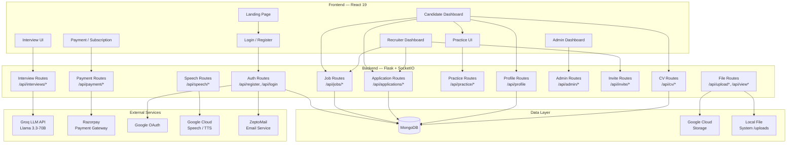
```mermaid
graph TB
    subgraph "Frontend — React 19"
        LP["Landing Page"]
        LOGIN["Login / Register"]
        CD["Candidate Dashboard"]
        RD["Recruiter Dashboard"]
        AD["Admin Dashboard"]
        INT["Interview UI"]
        PRAC["Practice UI"]
        PAY["Payment / Subscription"]
    end

    subgraph "Backend — Flask + SocketIO"
        AUTH["Auth Routes<br/>/api/register, /api/login"]
        JOB["Job Routes<br/>/api/jobs/*"]
        APP["Application Routes<br/>/api/applications/*"]
        PROF["Profile Routes<br/>/api/profile"]
        CV["CV Routes<br/>/api/cv/*"]
        INTAPI["Interview Routes<br/>/api/interviews/*"]
        PRACAPI["Practice Routes<br/>/api/practice/*"]
        PAYAPI["Payment Routes<br/>/api/payment/*"]
        ADMAPI["Admin Routes<br/>/api/admin/*"]
        INVAPI["Invite Routes<br/>/api/invite/*"]
        FILE["File Routes<br/>/api/upload*, /api/view*"]
        SPEECH["Speech Routes<br/>/api/speech/*"]
    end

    subgraph "Data Layer"
        MONGO[(MongoDB)]
        GCS["Google Cloud<br/>Storage"]
        UPLOADS["Local File<br/>System /uploads"]
    end

    subgraph "External Services"
        GROQ["Groq LLM API<br/>Llama 3.3-70B"]
        RAZORPAY["Razorpay<br/>Payment Gateway"]
        GOOGLE["Google OAuth"]
        GCLOUD["Google Cloud<br/>Speech / TTS"]
        ZEPTO["ZeptoMail<br/>Email Service"]
    end

    LP --> LOGIN
    LOGIN --> AUTH
    CD --> JOB & APP & PROF & CV & PRAC
    RD --> JOB & APP & INVAPI
    AD --> ADMAPI
    INT --> INTAPI
    PRAC --> PRACAPI
    PAY --> PAYAPI

    AUTH & JOB & APP & PROF & CV --> MONGO
    FILE --> UPLOADS & GCS
    INTAPI --> GROQ
    PAYAPI --> RAZORPAY
    AUTH --> GOOGLE
    SPEECH --> GCLOUD
    AUTH --> ZEPTO
```

### How it Works (Plain English)

1. **User opens website** → React app loads in browser
2. **All API calls** go to the Flask backend at `http://localhost:5000/api/...`
3. **JWT token** stored in `localStorage` is sent as `Authorization: Bearer <token>` header with every request
4. **Backend validates** the token using `auth_middleware.py`, looks up the user in MongoDB, and passes `current_user` to the route handler
5. **Route handler** calls the corresponding **Controller** which contains the business logic
6. **Controller** reads/writes to **MongoDB** and returns `(response_dict, status_code)`
7. **Response** flows back through Flask → HTTP → Frontend where React re-renders the UI

---

## 2. Authentication & Authorization Workflow

### 2.1 User Registration

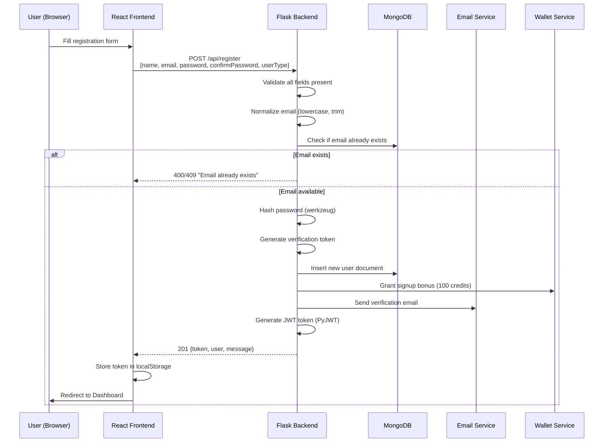
```mermaid
sequenceDiagram
    participant U as User (Browser)
    participant F as React Frontend
    participant B as Flask Backend
    participant DB as MongoDB
    participant E as Email Service
    participant W as Wallet Service

    U->>F: Fill registration form
    F->>B: POST /api/register<br/>{name, email, password, confirmPassword, userType}
    B->>B: Validate all fields present
    B->>B: Normalize email (lowercase, trim)
    B->>DB: Check if email already exists
    
    alt Email exists
        B-->>F: 400/409 "Email already exists"
    else Email available
        B->>B: Hash password (werkzeug)
        B->>B: Generate verification token
        B->>DB: Insert new user document
        B->>W: Grant signup bonus (100 credits)
        B->>E: Send verification email
        B->>B: Generate JWT token (PyJWT)
        B-->>F: 201 {token, user, message}
        F->>F: Store token in localStorage
        F->>U: Redirect to Dashboard
    end
```

**Key Points:**
- Candidates are **auto-verified** (`is_verified: true`)
- Recruiters require **admin approval** (`is_verified: false`)
- Email verification is configurable via `REQUIRE_EMAIL_VERIFICATION` env var
- Password is hashed using `werkzeug.security.generate_password_hash`
- JWT token expires based on `JWT_EXPIRATION_DAYS` (default: 1 day)
- Each email can only be associated with **one role** (candidate OR recruiter, not both)

### 2.2 User Login

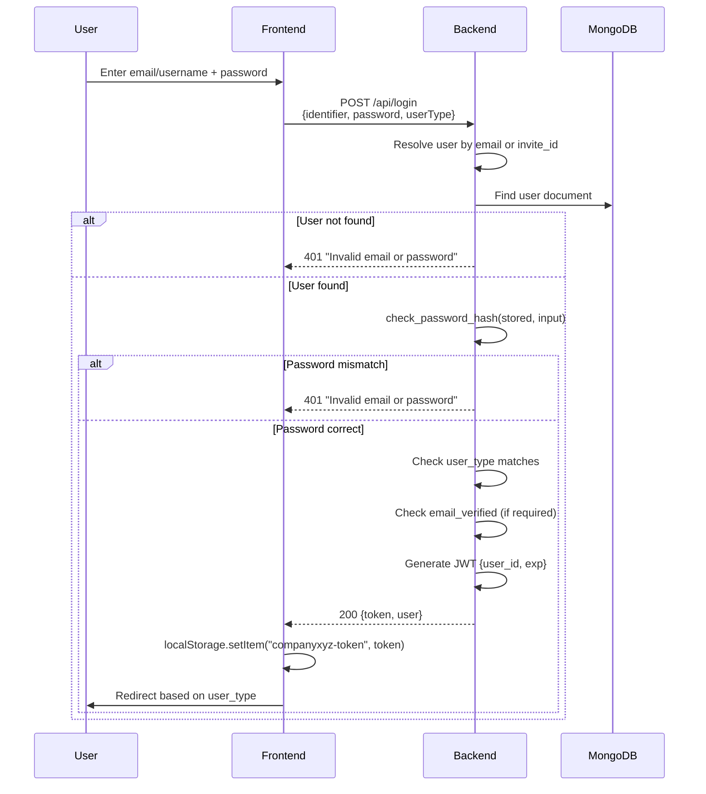
```mermaid
sequenceDiagram
    participant U as User
    participant F as Frontend
    participant B as Backend
    participant DB as MongoDB

    U->>F: Enter email/username + password
    F->>B: POST /api/login<br/>{identifier, password, userType}
    B->>B: Resolve user by email or invite_id
    B->>DB: Find user document
    
    alt User not found
        B-->>F: 401 "Invalid email or password"
    else User found
        B->>B: check_password_hash(stored, input)
        alt Password mismatch
            B-->>F: 401 "Invalid email or password"
        else Password correct
            B->>B: Check user_type matches
            B->>B: Check email_verified (if required)
            B->>B: Generate JWT {user_id, exp}
            B-->>F: 200 {token, user}
            F->>F: localStorage.setItem("companyxyz-token", token)
            F->>U: Redirect based on user_type
        end
    end
```

**Login supports:**
- Email-based login (`identifier` contains `@`)
- Invite-ID based login (for invited candidates)
- Legacy `username` field for backward compatibility

### 2.3 Google OAuth Login

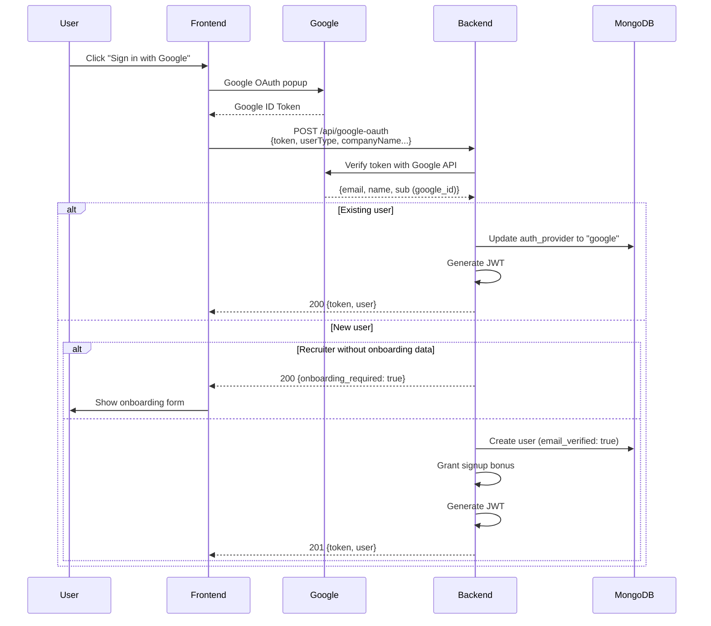
```mermaid
sequenceDiagram
    participant U as User
    participant F as Frontend
    participant G as Google
    participant B as Backend
    participant DB as MongoDB

    U->>F: Click "Sign in with Google"
    F->>G: Google OAuth popup
    G-->>F: Google ID Token
    F->>B: POST /api/google-oauth<br/>{token, userType, companyName...}
    B->>G: Verify token with Google API
    G-->>B: {email, name, sub (google_id)}
    
    alt Existing user
        B->>DB: Update auth_provider to "google"
        B->>B: Generate JWT
        B-->>F: 200 {token, user}
    else New user
        alt Recruiter without onboarding data
            B-->>F: 200 {onboarding_required: true}
            F->>U: Show onboarding form
        else
            B->>DB: Create user (email_verified: true)
            B->>B: Grant signup bonus
            B->>B: Generate JWT
            B-->>F: 201 {token, user}
        end
    end
```

### 2.4 JWT Token Validation (Middleware)

Every protected API call goes through [auth_middleware.py](file:///d:/HR%20Tech/product-prototyping-lab/python-backend/middleware/auth_middleware.py):

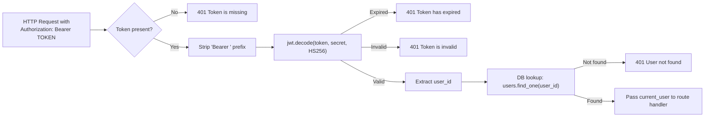
```mermaid
flowchart LR
    A["HTTP Request with<br/>Authorization: Bearer TOKEN"] --> B{"Token present?"}
    B -->|No| C["401 Token is missing"]
    B -->|Yes| D["Strip 'Bearer ' prefix"]
    D --> E["jwt.decode(token, secret, HS256)"]
    E -->|Expired| F["401 Token has expired"]
    E -->|Invalid| G["401 Token is invalid"]
    E -->|Valid| H["Extract user_id"]
    H --> I["DB lookup: users.find_one(user_id)"]
    I -->|Not found| J["401 User not found"]
    I -->|Found| K["Pass current_user to route handler"]
```

**Additional middleware decorators:**
| Decorator | Purpose |
|-----------|---------|
| `@token_required` | Validates JWT, injects `current_user` |
| `@admin_required` | Checks `user_type == 'admin'` |
| `@recruiter_required` | Checks `user_type in ['recruiter', 'admin']` |
| `@verified_required` | For recruiters: checks `is_verified == True` |
| `@permission_required(perm)` | Checks specific permission string |

### 2.5 Password Reset Flow

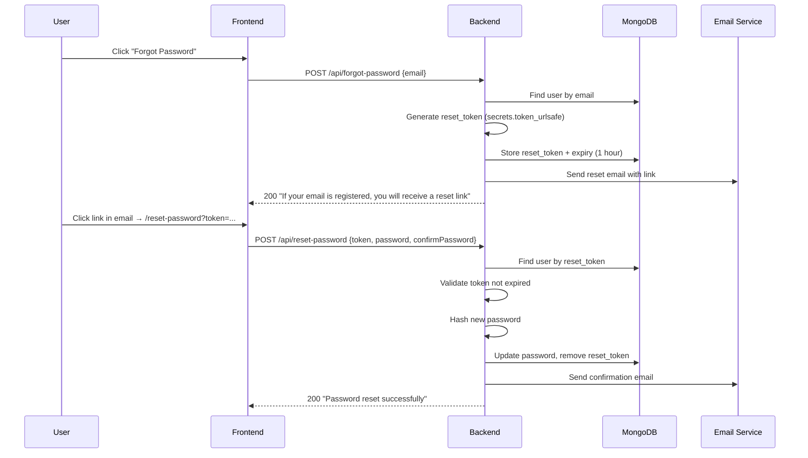
```mermaid
sequenceDiagram
    participant U as User
    participant F as Frontend
    participant B as Backend
    participant DB as MongoDB
    participant E as Email Service

    U->>F: Click "Forgot Password"
    F->>B: POST /api/forgot-password {email}
    B->>DB: Find user by email
    B->>B: Generate reset_token (secrets.token_urlsafe)
    B->>DB: Store reset_token + expiry (1 hour)
    B->>E: Send reset email with link
    B-->>F: 200 "If your email is registered, you will receive a reset link"

    U->>F: Click link in email → /reset-password?token=...
    F->>B: POST /api/reset-password {token, password, confirmPassword}
    B->>DB: Find user by reset_token
    B->>B: Validate token not expired
    B->>B: Hash new password
    B->>DB: Update password, remove reset_token
    B->>E: Send confirmation email
    B-->>F: 200 "Password reset successfully"
```

---

## 3. Candidate Workflows

### 3.1 Dashboard — Browse & Search Jobs

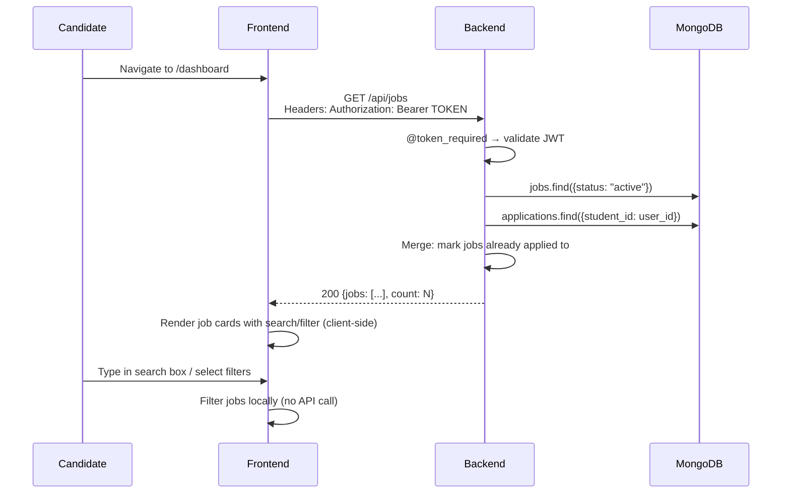
```mermaid
sequenceDiagram
    participant C as Candidate
    participant F as Frontend
    participant B as Backend
    participant DB as MongoDB

    C->>F: Navigate to /dashboard
    F->>B: GET /api/jobs<br/>Headers: Authorization: Bearer TOKEN
    B->>B: @token_required → validate JWT
    B->>DB: jobs.find({status: "active"})
    B->>DB: applications.find({student_id: user_id})
    B->>B: Merge: mark jobs already applied to
    B-->>F: 200 {jobs: [...], count: N}
    F->>F: Render job cards with search/filter (client-side)
    C->>F: Type in search box / select filters
    F->>F: Filter jobs locally (no API call)
```

**What the response contains for each job:**
- `_id`, `title`, `company`, `description`, `location`, `type`, `salary`
- `skills[]`, `responsibilities[]`, `requirements[]`, `benefits[]`
- `experience`, `department`, `created_at`
- `application_count`, `has_applied` (boolean for current user)

### 3.2 View Job Details & Apply

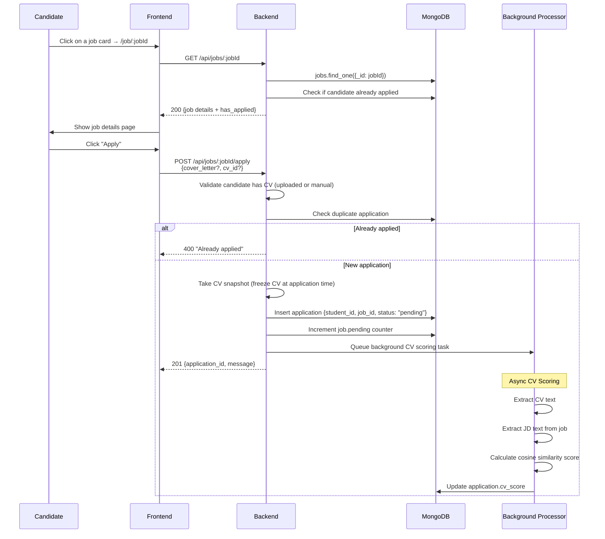
```mermaid
sequenceDiagram
    participant C as Candidate
    participant F as Frontend
    participant B as Backend
    participant DB as MongoDB
    participant BG as Background Processor

    C->>F: Click on a job card → /job/:jobId
    F->>B: GET /api/jobs/:jobId
    B->>DB: jobs.find_one({_id: jobId})
    B->>DB: Check if candidate already applied
    B-->>F: 200 {job details + has_applied}
    F->>C: Show job details page

    C->>F: Click "Apply"
    F->>B: POST /api/jobs/:jobId/apply<br/>{cover_letter?, cv_id?}
    B->>B: Validate candidate has CV (uploaded or manual)
    B->>DB: Check duplicate application
    
    alt Already applied
        B-->>F: 400 "Already applied"
    else New application
        B->>B: Take CV snapshot (freeze CV at application time)
        B->>DB: Insert application {student_id, job_id, status: "pending"}
        B->>DB: Increment job.pending counter
        B->>BG: Queue background CV scoring task
        B-->>F: 201 {application_id, message}
        
        Note over BG: Async CV Scoring
        BG->>BG: Extract CV text
        BG->>BG: Extract JD text from job
        BG->>BG: Calculate cosine similarity score
        BG->>DB: Update application.cv_score
    end
```

**CV Snapshot mechanism**: When a candidate applies, the system captures a frozen copy of their CV at that moment. This ensures the recruiter always sees the same CV the candidate had when they applied, even if the candidate updates their CV later.

### 3.3 Withdraw Application

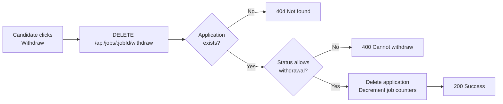
```mermaid
flowchart LR
    A["Candidate clicks<br/>Withdraw"] --> B["DELETE /api/jobs/:jobId/withdraw"]
    B --> C{"Application<br/>exists?"}
    C -->|No| D["404 Not found"]
    C -->|Yes| E{"Status allows<br/>withdrawal?"}
    E -->|No| F["400 Cannot withdraw"]
    E -->|Yes| G["Delete application<br/>Decrement job counters"]
    G --> H["200 Success"]
```

### 3.4 Profile Management

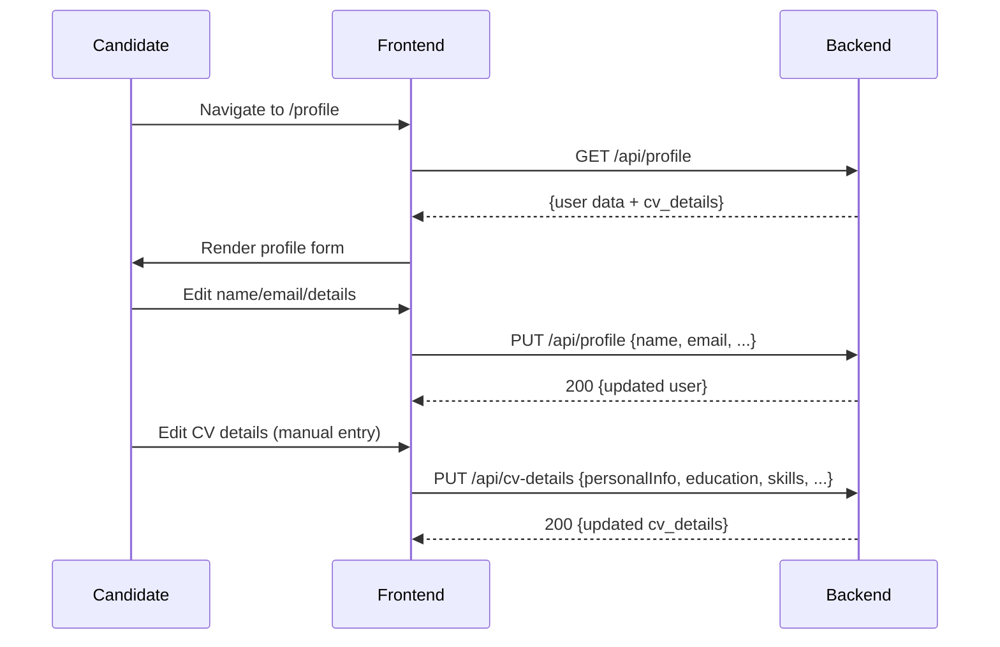
```mermaid
sequenceDiagram
    participant C as Candidate
    participant F as Frontend
    participant B as Backend

    C->>F: Navigate to /profile
    F->>B: GET /api/profile
    B-->>F: {user data + cv_details}
    F->>C: Render profile form

    C->>F: Edit name/email/details
    F->>B: PUT /api/profile {name, email, ...}
    B-->>F: 200 {updated user}

    C->>F: Edit CV details (manual entry)
    F->>B: PUT /api/cv-details {personalInfo, education, skills, ...}
    B-->>F: 200 {updated cv_details}
```

### 3.5 CV Management (Multi-CV System)

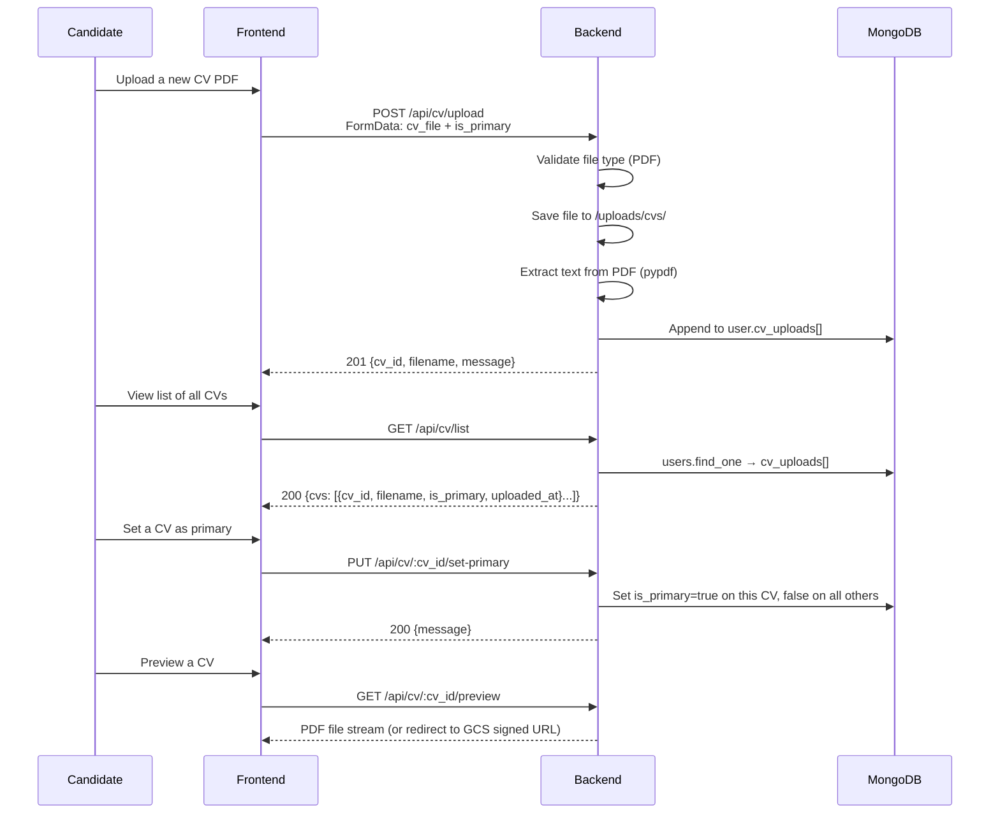
```mermaid
sequenceDiagram
    participant C as Candidate
    participant F as Frontend
    participant B as Backend
    participant DB as MongoDB

    C->>F: Upload a new CV PDF
    F->>B: POST /api/cv/upload<br/>FormData: cv_file + is_primary
    B->>B: Validate file type (PDF)
    B->>B: Save file to /uploads/cvs/
    B->>B: Extract text from PDF (pypdf)
    B->>DB: Append to user.cv_uploads[]
    B-->>F: 201 {cv_id, filename, message}

    C->>F: View list of all CVs
    F->>B: GET /api/cv/list
    B->>DB: users.find_one → cv_uploads[]
    B-->>F: 200 {cvs: [{cv_id, filename, is_primary, uploaded_at}...]}

    C->>F: Set a CV as primary
    F->>B: PUT /api/cv/:cv_id/set-primary
    B->>DB: Set is_primary=true on this CV, false on all others
    B-->>F: 200 {message}

    C->>F: Preview a CV
    F->>B: GET /api/cv/:cv_id/preview
    B-->>F: PDF file stream (or redirect to GCS signed URL)
```

---

## 4. Recruiter Workflows

### 4.1 Recruiter Onboarding

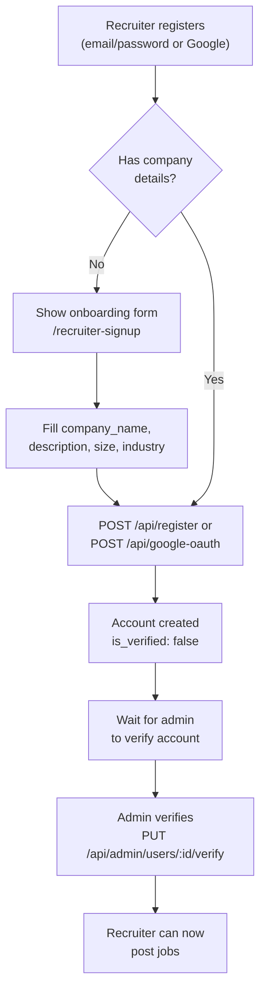
```mermaid
flowchart TD
    A["Recruiter registers<br/>(email/password or Google)"] --> B{"Has company<br/>details?"}
    B -->|No| C["Show onboarding form<br/>/recruiter-signup"]
    C --> D["Fill company_name,<br/>description, size, industry"]
    D --> E["POST /api/register or<br/>POST /api/google-oauth"]
    B -->|Yes| E
    E --> F["Account created<br/>is_verified: false"]
    F --> G["Wait for admin<br/>to verify account"]
    G --> H["Admin verifies<br/>PUT /api/admin/users/:id/verify"]
    H --> I["Recruiter can now<br/>post jobs"]
```

### 4.2 Create a Job Posting

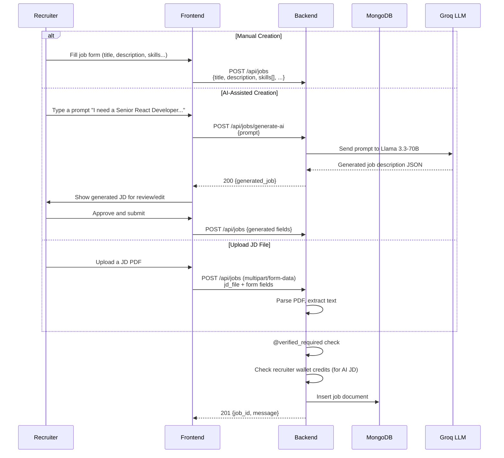
```mermaid
sequenceDiagram
    participant R as Recruiter
    participant F as Frontend
    participant B as Backend
    participant DB as MongoDB
    participant LLM as Groq LLM

    alt Manual Creation
        R->>F: Fill job form (title, description, skills...)
        F->>B: POST /api/jobs<br/>{title, description, skills[], ...}
    else AI-Assisted Creation
        R->>F: Type a prompt "I need a Senior React Developer..."
        F->>B: POST /api/jobs/generate-ai<br/>{prompt}
        B->>LLM: Send prompt to Llama 3.3-70B
        LLM-->>B: Generated job description JSON
        B-->>F: 200 {generated_job}
        F->>R: Show generated JD for review/edit
        R->>F: Approve and submit
        F->>B: POST /api/jobs {generated fields}
    else Upload JD File
        R->>F: Upload a JD PDF
        F->>B: POST /api/jobs (multipart/form-data)<br/>jd_file + form fields
        B->>B: Parse PDF, extract text
    end

    B->>B: @verified_required check
    B->>B: Check recruiter wallet credits (for AI JD)
    B->>DB: Insert job document
    B-->>F: 201 {job_id, message}
```

### 4.3 Manage Applications (Review Candidates)

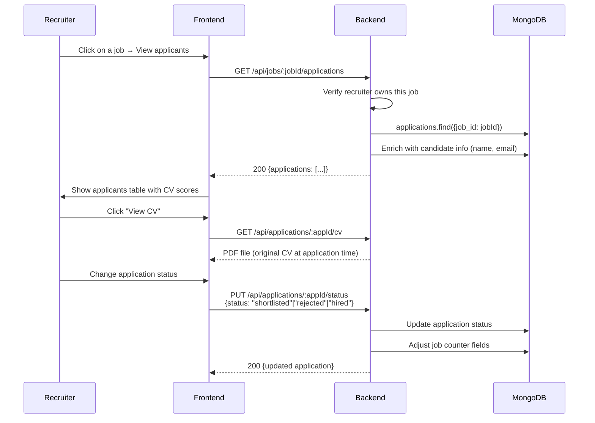
```mermaid
sequenceDiagram
    participant R as Recruiter
    participant F as Frontend
    participant B as Backend
    participant DB as MongoDB

    R->>F: Click on a job → View applicants
    F->>B: GET /api/jobs/:jobId/applications
    B->>B: Verify recruiter owns this job
    B->>DB: applications.find({job_id: jobId})
    B->>DB: Enrich with candidate info (name, email)
    B-->>F: 200 {applications: [...]}
    F->>R: Show applicants table with CV scores

    R->>F: Click "View CV"
    F->>B: GET /api/applications/:appId/cv
    B-->>F: PDF file (original CV at application time)

    R->>F: Change application status
    F->>B: PUT /api/applications/:appId/status<br/>{status: "shortlisted"|"rejected"|"hired"}
    B->>DB: Update application status
    B->>DB: Adjust job counter fields
    B-->>F: 200 {updated application}
```

### 4.4 View Interview Reports

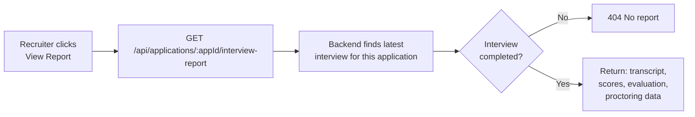
```mermaid
flowchart LR
    A["Recruiter clicks<br/>View Report"] --> B["GET /api/applications/:appId/interview-report"]
    B --> C["Backend finds latest<br/>interview for this application"]
    C --> D{"Interview<br/>completed?"}
    D -->|No| E["404 No report"]
    D -->|Yes| F["Return: transcript,<br/>scores, evaluation,<br/>proctoring data"]
```

---

## 5. Interview System Workflow (AI-Powered)

This is the most complex workflow in the entire platform. Here's the complete flow:

### 5.1 Starting an Interview

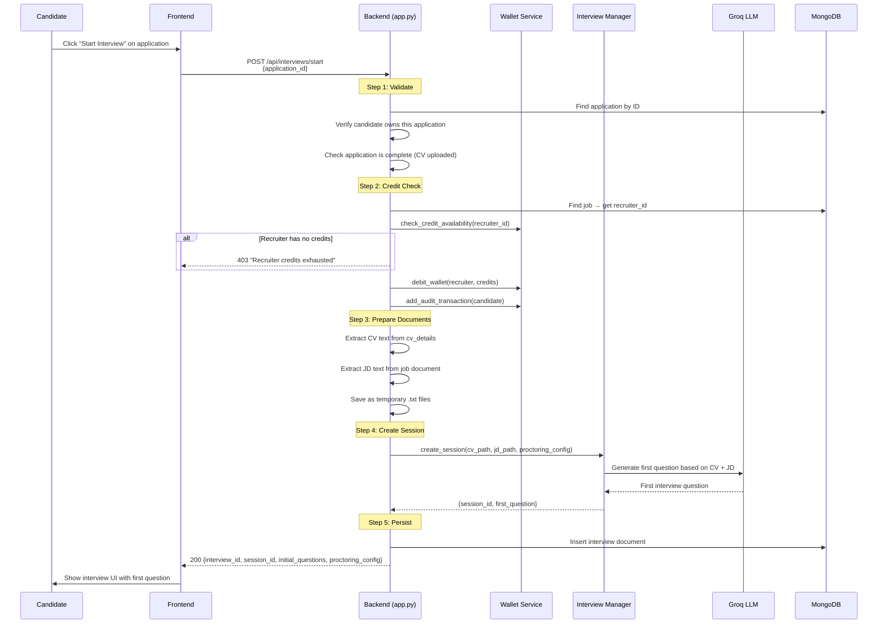
```mermaid
sequenceDiagram
    participant C as Candidate
    participant F as Frontend
    participant B as Backend (app.py)
    participant W as Wallet Service
    participant IM as Interview Manager
    participant LLM as Groq LLM
    participant DB as MongoDB

    C->>F: Click "Start Interview" on application
    F->>B: POST /api/interviews/start<br/>{application_id}

    Note over B: Step 1: Validate
    B->>DB: Find application by ID
    B->>B: Verify candidate owns this application
    B->>B: Check application is complete (CV uploaded)

    Note over B: Step 2: Credit Check
    B->>DB: Find job → get recruiter_id
    B->>W: check_credit_availability(recruiter_id)
    
    alt Recruiter has no credits
        B-->>F: 403 "Recruiter credits exhausted"
    end

    B->>W: debit_wallet(recruiter, credits)
    B->>W: add_audit_transaction(candidate)

    Note over B: Step 3: Prepare Documents
    B->>B: Extract CV text from cv_details
    B->>B: Extract JD text from job document
    B->>B: Save as temporary .txt files

    Note over B: Step 4: Create Session
    B->>IM: create_session(cv_path, jd_path, proctoring_config)
    IM->>LLM: Generate first question based on CV + JD
    LLM-->>IM: First interview question
    IM-->>B: {session_id, first_question}

    Note over B: Step 5: Persist
    B->>DB: Insert interview document
    B-->>F: 200 {interview_id, session_id, initial_questions, proctoring_config}

    F->>C: Show interview UI with first question
```

### 5.2 During the Interview (Q&A Loop)

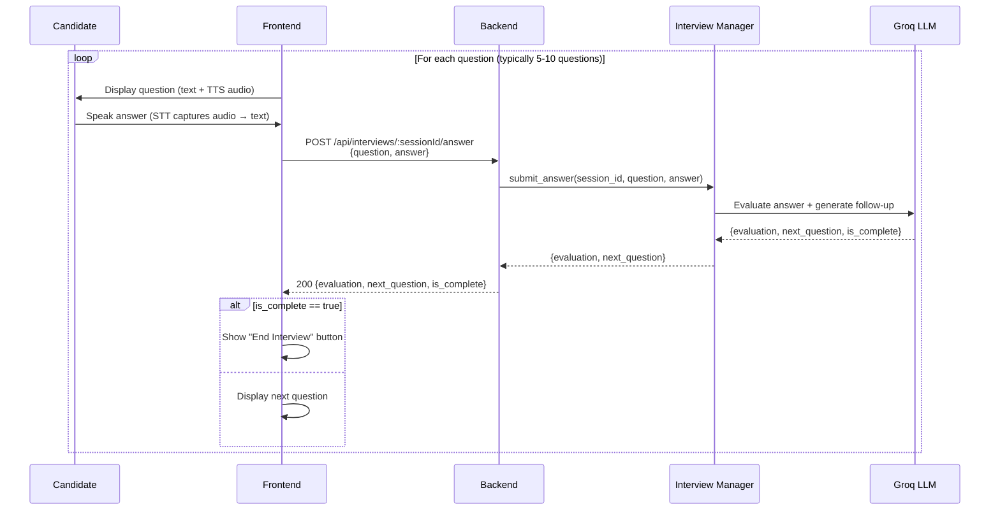
```mermaid
sequenceDiagram
    participant C as Candidate
    participant F as Frontend
    participant B as Backend
    participant IM as Interview Manager
    participant LLM as Groq LLM

    loop For each question (typically 5-10 questions)
        F->>C: Display question (text + TTS audio)
        C->>F: Speak answer (STT captures audio → text)
        F->>B: POST /api/interviews/:sessionId/answer<br/>{question, answer}
        B->>IM: submit_answer(session_id, question, answer)
        IM->>LLM: Evaluate answer + generate follow-up
        LLM-->>IM: {evaluation, next_question, is_complete}
        IM-->>B: {evaluation, next_question}
        B-->>F: 200 {evaluation, next_question, is_complete}
        
        alt is_complete == true
            F->>F: Show "End Interview" button
        else
            F->>F: Display next question
        end
    end
```

**Answer evaluation includes:**
- Relevance score (0-100)
- Depth score
- Completeness score  
- AI probability detection (checks if answer is AI-generated)
- Follow-up question generation based on answer quality

### 5.3 Ending the Interview

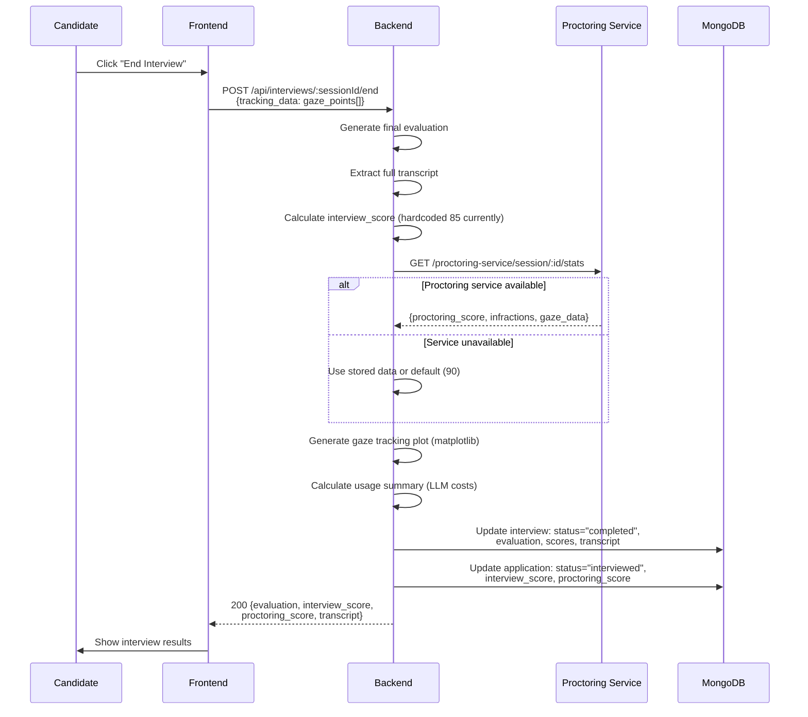
```mermaid
sequenceDiagram
    participant C as Candidate
    participant F as Frontend
    participant B as Backend
    participant PS as Proctoring Service
    participant DB as MongoDB

    C->>F: Click "End Interview"
    F->>B: POST /api/interviews/:sessionId/end<br/>{tracking_data: gaze_points[]}

    B->>B: Generate final evaluation
    B->>B: Extract full transcript
    B->>B: Calculate interview_score (hardcoded 85 currently)
    
    B->>PS: GET /proctoring-service/session/:id/stats
    alt Proctoring service available
        PS-->>B: {proctoring_score, infractions, gaze_data}
    else Service unavailable
        B->>B: Use stored data or default (90)
    end

    B->>B: Generate gaze tracking plot (matplotlib)
    B->>B: Calculate usage summary (LLM costs)

    B->>DB: Update interview: status="completed",<br/>evaluation, scores, transcript
    B->>DB: Update application: status="interviewed",<br/>interview_score, proctoring_score

    B-->>F: 200 {evaluation, interview_score,<br/>proctoring_score, transcript}
    F->>C: Show interview results
```

### 5.4 Proctoring System

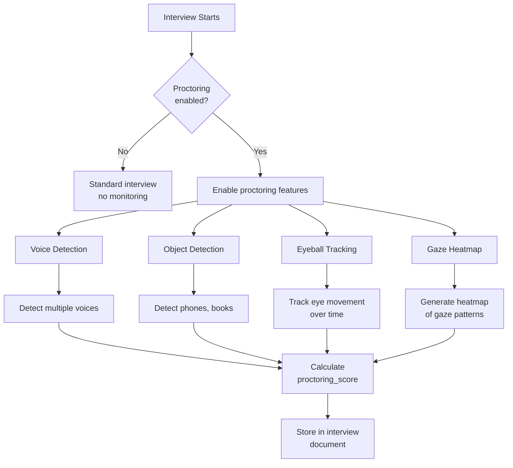
```mermaid
flowchart TD
    A["Interview Starts"] --> B{"Proctoring<br/>enabled?"}
    B -->|No| C["Standard interview<br/>no monitoring"]
    B -->|Yes| D["Enable proctoring features"]
    
    D --> E["Voice Detection"]
    D --> F["Object Detection"]
    D --> G["Eyeball Tracking"]
    D --> H["Gaze Heatmap"]
    
    E --> I["Detect multiple voices"]
    F --> J["Detect phones, books"]
    G --> K["Track eye movement<br/>over time"]
    H --> L["Generate heatmap<br/>of gaze patterns"]
    
    I & J & K & L --> M["Calculate<br/>proctoring_score"]
    M --> N["Store in interview<br/>document"]
```

**Proctoring config is per-job:**
```json
{
  "voice_detection": true,
  "object_detection": true,
  "eyeball_tracking": true,
  "gaze_heatmap": true
}
```

---

## 6. Practice Interview Workflow

Practice interviews allow candidates to practice before real interviews, using their credits.

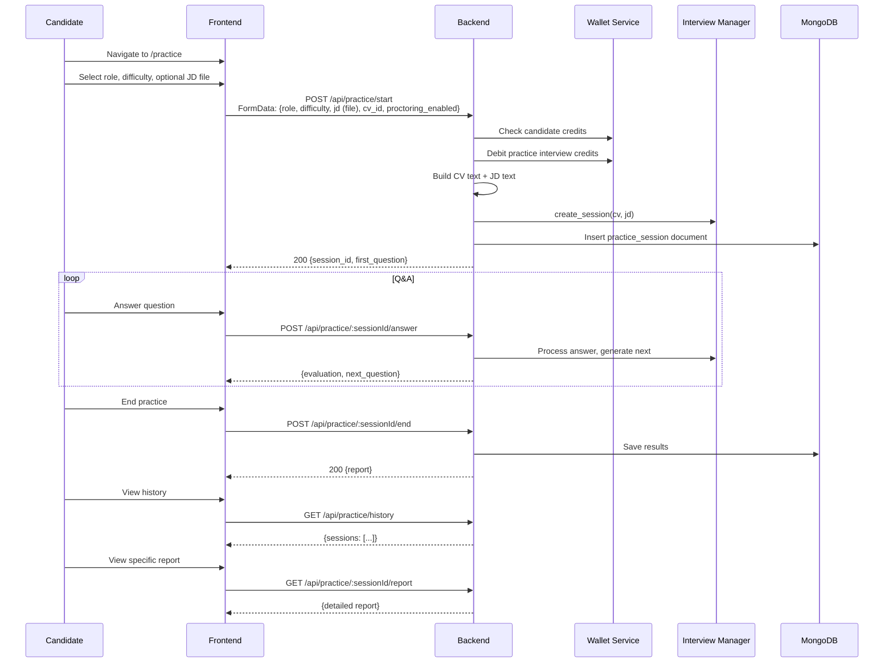
```mermaid
sequenceDiagram
    participant C as Candidate
    participant F as Frontend
    participant B as Backend
    participant W as Wallet Service
    participant IM as Interview Manager
    participant DB as MongoDB

    C->>F: Navigate to /practice
    C->>F: Select role, difficulty, optional JD file

    F->>B: POST /api/practice/start<br/>FormData: {role, difficulty, jd (file), cv_id, proctoring_enabled}

    B->>W: Check candidate credits
    B->>W: Debit practice interview credits
    B->>B: Build CV text + JD text
    B->>IM: create_session(cv, jd)
    B->>DB: Insert practice_session document
    B-->>F: 200 {session_id, first_question}

    loop Q&A
        C->>F: Answer question
        F->>B: POST /api/practice/:sessionId/answer
        B->>IM: Process answer, generate next
        B-->>F: {evaluation, next_question}
    end

    C->>F: End practice
    F->>B: POST /api/practice/:sessionId/end
    B->>DB: Save results
    B-->>F: 200 {report}

    C->>F: View history
    F->>B: GET /api/practice/history
    B-->>F: {sessions: [...]}

    C->>F: View specific report
    F->>B: GET /api/practice/:sessionId/report
    B-->>F: {detailed report}
```

---

## 7. Payment & Wallet System

### 7.1 Architecture Overview

```mermaid
flowchart TD
    subgraph "Credit Wallet System"
        A["User registers"] --> B["Grant signup bonus<br/>(100 credits)"]
        B --> C["Wallet Created<br/>balance: 100"]
        
        D["User buys plan"] --> E["Razorpay checkout"]
        E --> F["Payment verified"]
        F --> G["Credits added<br/>to wallet"]
        
        H["Interview starts"] --> I{"Check credits"}
        I -->|Enough| J["Debit credits"]
        I -->|Not enough| K["403 Insufficient credits"]
        
        L["AI JD Generation"] --> M["Debit credits"]
    end
```

### 7.2 Recharge Flow (Razorpay)

```mermaid
sequenceDiagram
    participant U as User
    participant F as Frontend
    participant B as Backend
    participant R as Razorpay
    participant DB as MongoDB

    U->>F: Navigate to /subscription
    F->>B: GET /api/payment/recharge/packs
    B-->>F: Available plans (filtered by user role)

    U->>F: Select a plan
    F->>B: POST /api/payment/recharge/initiate<br/>{plan_id}
    B->>R: razorpay.Order.create({amount, currency: "INR"})
    R-->>B: {order_id, amount, key_id}
    B->>DB: Store pending payment record
    B-->>F: {order_id, amount, key_id}

    F->>R: Open Razorpay checkout modal
    U->>R: Complete payment (UPI/card/netbanking)
    R-->>F: {razorpay_order_id, razorpay_payment_id, razorpay_signature}

    F->>B: POST /api/payment/recharge/verify<br/>{order_id, payment_id, signature}
    B->>R: Verify signature (HMAC SHA256)
    
    alt Signature valid
        B->>DB: Update payment status = "captured"
        B->>DB: Credit wallet with plan credits
        B-->>F: 200 {success, new_balance}
        F->>U: Redirect to /payment/success
    else Signature invalid
        B-->>F: 400 "Payment verification failed"
        F->>U: Redirect to /payment/cancel
    end
```

### 7.3 Credit Deduction Table

| Action | Who Pays | Credits |
|--------|----------|---------|
| Real Interview (no proctoring) | Recruiter | `RECRUITER_REAL_INTERVIEW_CREDITS` |
| Real Interview (with proctoring) | Recruiter | `RECRUITER_REAL_INTERVIEW_PROCTORED_CREDITS` |
| Practice Interview | Candidate | Varies by config |
| AI JD Generation | Recruiter | Per-generation cost |

### 7.4 Razorpay Webhook

```mermaid
flowchart LR
    A["Razorpay sends webhook<br/>POST /api/payment/webhooks/razorpay"] --> B["Verify X-Razorpay-Signature"]
    B -->|Invalid| C["200 OK (acknowledge but ignore)"]
    B -->|Valid| D["Process event"]
    D --> E{"Event type?"}
    E -->|payment.captured| F["Fulfill order<br/>Credit wallet"]
    E -->|payment.failed| G["Mark payment failed"]
    E -->|refund.created| H["Process refund"]
```

---

## 8. Invite System (Recruiter → Candidate)

This allows recruiters to invite candidates directly to apply for specific jobs.

```mermaid
sequenceDiagram
    participant R as Recruiter
    participant F as Frontend
    participant B as Backend
    participant DB as MongoDB
    participant E as Email Service
    participant C as Candidate

    R->>F: Open invite modal on job page
    R->>F: Paste emails or upload CSV

    F->>B: POST /api/recruiter/jobs/:jobId/invites/preview<br/>{text/file/email}
    B->>B: Parse and classify emails
    B-->>F: {valid: [...], invalid: [...], already_invited: [...]}

    R->>F: Confirm and send invites
    F->>B: POST /api/recruiter/jobs/:jobId/invites<br/>{emails, invite_type: "apply"|"shortlist"}

    B->>DB: Create invite_token for each email
    B->>DB: Create burner account (is_invite_only: true)
    B->>E: Send invite email with magic link
    B-->>F: 200 {sent: N, failed: N}

    Note over C: Candidate receives email
    C->>F: Clicks magic link → /invite/redeem?token=...
    F->>B: GET /api/invite/redeem?token=TOKEN
    B->>DB: Find invite_token by hash
    B-->>F: {job details, invite info}

    C->>F: Set password (if first time)
    F->>B: POST /api/invite/redeem {token}
    B->>DB: Activate account, mark token consumed
    B-->>F: {token (JWT), user, redirect_url}
    F->>C: Redirect to job page to complete application
```

### Invite Cleanup Scheduler

A background scheduler runs periodically to clean up dormant invite accounts:
- Removes burner accounts that never completed their registration
- Runs via [invite_cleanup_scheduler.py](file:///d:/HR%20Tech/product-prototyping-lab/python-backend/services/invite_cleanup_scheduler.py)

---

## 9. Admin Portal Workflows

### 9.1 Admin Dashboard Overview

```mermaid
flowchart TD
    A["Admin logs in<br/>/admin"] --> B["GET /api/admin/stats"]
    B --> C["Dashboard shows:"]
    C --> D["Total users<br/>(candidates + recruiters)"]
    C --> E["Total jobs posted"]
    C --> F["Total applications"]
    C --> G["Total interviews conducted"]
    C --> H["Pending recruiter<br/>verifications"]
```

### 9.2 Recruiter Verification

```mermaid
sequenceDiagram
    participant A as Admin
    participant F as Frontend
    participant B as Backend
    participant DB as MongoDB

    A->>F: Navigate to /admin/verification
    F->>B: GET /api/admin/pending-recruiters
    B->>DB: users.find({user_type: "recruiter", is_verified: false})
    B-->>F: {recruiters: [...]}

    A->>F: Click "Verify" on a recruiter
    F->>B: PUT /api/admin/users/:recruiterId/verify
    B->>DB: Update is_verified=true, verified_by=admin_id
    B-->>F: 200 {message}

    alt Reject
        A->>F: Click "Reject" with reason
        F->>B: PUT /api/admin/users/:recruiterId/reject<br/>{reason}
        B->>DB: Update is_verified=false, rejection_reason
        B-->>F: 200 {message}
    end
```

### 9.3 Admin Cost Statistics

```mermaid
flowchart LR
    A["GET /api/admin/cost-statistics"] --> B["Platform-wide usage stats"]
    C["GET /api/admin/cost-statistics/candidates/usage"] --> D["Per-candidate usage summary"]
    E["GET /api/admin/cost-statistics/recruiters/usage"] --> F["Per-recruiter usage summary"]
    G["GET /.../candidates/:id/usage-lines"] --> H["Individual transaction lines"]
    I["GET /.../credit-summary"] --> J["Credit balance summaries"]
```

### 9.4 Full Admin API Surface

| Endpoint | Method | Purpose |
|----------|--------|---------|
| `/api/admin/stats` | GET | Dashboard statistics |
| `/api/admin/users` | GET | List users (filterable) |
| `/api/admin/users/:id` | GET / DELETE | User details / delete |
| `/api/admin/users/:id/verify` | PUT | Verify recruiter |
| `/api/admin/users/:id/reject` | PUT | Reject recruiter |
| `/api/admin/users/:id/permissions` | PUT | Update permissions |
| `/api/admin/users/:id/user-type` | PUT | Change user role |
| `/api/admin/candidates/:id` | GET / PUT | Candidate details |
| `/api/admin/recruiters/:id` | GET / PUT | Recruiter details |
| `/api/admin/jobs` | GET | List all jobs |
| `/api/admin/jobs/:id` | GET / PUT / DELETE | Job CRUD |
| `/api/admin/applications/:id` | GET / PUT / DELETE | Application CRUD |
| `/api/admin/applications/:id/status` | PUT | Change app status |
| `/api/admin/applications/:id/report` | GET | Interview report |
| `/api/admin/cost-statistics` | GET | Platform cost stats |

---

## 10. File Management (CV, Photo, Recordings)

### 10.1 Upload & Storage Flow

```mermaid
flowchart TD
    subgraph "Upload Destinations"
        A["CV Upload<br/>POST /api/upload-cv"] --> B["/uploads/cvs/"]
        C["Photo Upload<br/>POST /api/upload-photo"] --> D["/uploads/photos/"]
        E["Recording Upload<br/>POST /api/.../upload-recording"] --> F["/uploads/recordings/"]
        G["Mobile Recording<br/>POST /api/.../upload-mobile-recording"] --> H["/uploads/mobile_recordings/"]
    end

    subgraph "Storage Options"
        B --> I{"GCS configured?"}
        I -->|Yes| J["Upload to Google Cloud Storage"]
        I -->|No| K["Keep on local filesystem"]
    end
```

### 10.2 CV Download Priority

When a recruiter views a candidate's application CV:

```mermaid
flowchart TD
    A["Request CV for application"] --> B{"Specific cv_id<br/>in application?"}
    B -->|Yes| C["Find CV in<br/>user.cv_uploads[]"]
    B -->|No| D{"cv_snapshot<br/>has file_path?"}
    C -->|Found| G["Serve file"]
    C -->|Not found| D
    D -->|Yes| E["Serve snapshot file"]
    D -->|No| F{"Legacy cv_path<br/>on user?"}
    F -->|Yes| G
    F -->|No| H{"Manual entry?"}
    H -->|Yes| I["Generate PDF<br/>from cv_details"]
    H -->|No| J["404 CV not found"]
    I --> G
```

---

## 11. Background Services & Schedulers

```mermaid
flowchart TD
    subgraph "Background Processor"
        A["CV Scoring Queue"] --> B["Process each queued application"]
        B --> C["Extract CV text"]
        C --> D["Extract JD text from job"]
        D --> E["Calculate cosine similarity<br/>(sentence transformers)"]
        E --> F["Update application.cv_score"]
    end

    subgraph "Invite Cleanup Scheduler"
        G["Runs periodically"] --> H["Find dormant invite accounts"]
        H --> I["Delete accounts with<br/>no activity past threshold"]
    end

    subgraph "Startup Tasks"
        J["App starts"] --> K["Bootstrap signup bonus<br/>for existing users"]
        J --> L["Ensure DB indexes"]
        J --> M["Start background processor"]
        J --> N["Start invite cleanup scheduler"]
    end
```

---

## 12. Real-time Features (WebSocket / Socket.IO)

```mermaid
sequenceDiagram
    participant D as Desktop Browser
    participant S as Flask-SocketIO Server
    participant M as Mobile Device

    Note over D,S: Mobile Camera for Proctoring

    D->>S: emit("join_mobile_session", {session_id})
    S->>S: join_room(session_id)

    M->>S: emit("join_mobile_session", {session_id})
    S->>D: emit("mobile_connected", {status: "connected"})

    D->>S: emit("control_mobile_recording", {action: "start"})
    S->>M: emit("mobile_recording_action", {action: "start"})

    M->>S: emit("mobile_status_update", {status: "recording"})
    S->>D: emit("mobile_status_dashboard", {status: "recording"})

    D->>S: emit("control_mobile_recording", {action: "stop"})
    S->>M: emit("mobile_recording_action", {action: "stop"})
```

---

## 13. Complete API Reference

### Auth Module (`/api`)
| Method | Endpoint | Auth | Description |
|--------|----------|------|-------------|
| POST | `/api/register` | ❌ | Register new user |
| POST | `/api/login` | ❌ | Login with email/invite-ID |
| POST | `/api/google-oauth` | ❌ | Google OAuth login |
| GET | `/api/me` | ✅ | Get current user info |
| POST | `/api/verify-email` | ❌ | Verify email token |
| POST | `/api/resend-verification` | ❌ | Resend verification email |
| POST | `/api/forgot-password` | ❌ | Request password reset |
| POST | `/api/reset-password` | ❌ | Reset password with token |
| POST | `/api/check-email-account-type` | ❌ | Check email availability |

### Jobs Module (`/api`)
| Method | Endpoint | Auth | Description |
|--------|----------|------|-------------|
| GET | `/api/jobs` | ✅ | List jobs (role-filtered) |
| POST | `/api/jobs` | ✅🔒 | Create job (verified recruiter) |
| POST | `/api/jobs/generate-ai` | ✅🔒 | AI-generate job description |
| GET | `/api/jobs/:id` | ✅ | Get job details |
| PUT | `/api/jobs/:id` | ✅🔒 | Update job |
| DELETE | `/api/jobs/:id` | ✅🔒 | Delete job |
| GET | `/api/jobs/:id/applications` | ✅ | Get applicants for job |

### Applications Module (`/api`)
| Method | Endpoint | Auth | Description |
|--------|----------|------|-------------|
| POST | `/api/jobs/:id/apply` | ✅ | Apply for job |
| DELETE | `/api/jobs/:id/withdraw` | ✅ | Withdraw application |
| GET | `/api/applications` | ✅ | List own applications |
| GET | `/api/applications/:id` | ✅ | Get application details |
| PUT | `/api/applications/:id/status` | ✅ | Update status (recruiter) |
| GET | `/api/applications/:id/cv` | ✅ | Download application CV |
| GET | `/api/applications/:id/interview-report` | ✅ | Get interview report |
| POST | `/api/applications/:id/recalculate-score` | ✅ | Re-run CV scoring |
| PUT | `/api/applications/:id/update-score` | ✅ | Update interview score |

### Interview Module (`/api/interviews`)
| Method | Endpoint | Auth | Description |
|--------|----------|------|-------------|
| POST | `/api/interviews/start` | ✅ | Start AI interview |
| GET | `/api/interviews/:sessionId/question` | ❌ | Get next question |
| POST | `/api/interviews/:sessionId/answer` | ✅ | Submit answer |
| POST | `/api/interviews/:sessionId/end` | ✅ | End interview |
| GET | `/api/interviews` | ✅ | List user interviews |
| POST | `/api/interviews/:sessionId/register-face` | ✅ | Register face for proctoring |
| POST | `/api/interviews/:sessionId/upload-recording` | ✅ | Upload webcam recording |
| POST | `/api/interviews/:sessionId/upload-mobile-recording` | ❌ | Upload mobile recording |
| GET | `/api/interviews/:sessionId/gaze-recorder-page` | ❌ | Gaze recorder HTML page |
| POST | `/api/interviews/:sessionId/gaze-recorder-results` | ✅ | Submit gaze data |

### Practice Module (`/api/practice`)
| Method | Endpoint | Auth | Description |
|--------|----------|------|-------------|
| POST | `/api/practice/start` | ✅ | Start practice interview |
| POST | `/api/practice/:sessionId/answer` | ✅ | Submit practice answer |
| POST | `/api/practice/:sessionId/end` | ✅ | End practice session |
| GET | `/api/practice/history` | ✅ | Get practice history |
| GET | `/api/practice/:sessionId/report` | ✅ | Get practice report |

### CV Module (`/api/cv`)
| Method | Endpoint | Auth | Description |
|--------|----------|------|-------------|
| POST | `/api/cv/upload` | ✅ | Upload CV PDF |
| GET | `/api/cv/list` | ✅ | List all CVs |
| GET | `/api/cv/:cvId` | ✅ | Get CV details |
| DELETE | `/api/cv/:cvId` | ✅ | Delete a CV |
| PUT | `/api/cv/:cvId/set-primary` | ✅ | Set CV as primary |
| GET | `/api/cv/:cvId/preview` | ✅ | Preview/download CV |
| GET | `/api/cv/:cvId/download-url` | ✅ | Get signed download URL |
| GET | `/api/cv/:cvId/text` | ✅ | Get extracted text |

### Payment Module (`/api/payment`)
| Method | Endpoint | Auth | Description |
|--------|----------|------|-------------|
| GET | `/api/payment/plans` | ✅ | Get subscription plans |
| GET | `/api/payment/recharge/packs` | ✅ | Get recharge packs |
| POST | `/api/payment/recharge/initiate` | ✅ | Create Razorpay order |
| POST | `/api/payment/recharge/verify` | ✅ | Verify payment |
| GET | `/api/payment/wallet/summary` | ✅ | Get wallet balance |
| GET | `/api/payment/wallet/check` | ✅ | Can user interview? |
| GET | `/api/payment/wallet/transactions` | ✅ | Transaction history |
| GET | `/api/payment/payments/history` | ✅ | Payment history |
| POST | `/api/payment/payments/:id/refund` | ✅ | Request refund |
| POST | `/api/payment/subscriptions/cancel` | ✅ | Cancel subscription |
| POST | `/api/payment/webhooks/razorpay` | ❌ | Razorpay webhook |

### Profile Module (`/api`)
| Method | Endpoint | Auth | Description |
|--------|----------|------|-------------|
| GET | `/api/profile` | ✅ | Get user profile |
| PUT | `/api/profile` | ✅ | Update profile |
| PUT | `/api/company-profile` | ✅ | Update company profile |
| GET | `/api/cv-details` | ✅ | Get CV details |
| PUT | `/api/cv-details` | ✅ | Update CV details |
| GET | `/api/recruiter/cost-statistics` | ✅ | Recruiter cost dashboard |
| GET | `/api/candidate/cost-statistics` | ✅ | Candidate cost dashboard |

### Invite Module (`/api`)
| Method | Endpoint | Auth | Description |
|--------|----------|------|-------------|
| POST | `/api/recruiter/jobs/:id/invites/preview` | ✅🔒 | Preview invite emails |
| POST | `/api/recruiter/jobs/:id/invites` | ✅🔒 | Send invites |
| GET | `/api/invite/redeem?token=...` | ❌ | Lookup invite |
| POST | `/api/invite/redeem` | ❌ | Consume invite token |

### Misc
| Method | Endpoint | Auth | Description |
|--------|----------|------|-------------|
| GET | `/health` | ❌ | Health check |
| POST | `/api/chat` | ❌ | LLM chat with cost tracking |
| GET | `/api/cost-summary` | ❌ | LLM cost summary |

**Legend:** ✅ = JWT required, 🔒 = Recruiter/Admin + Verified, ❌ = Public

---

## 14. Production Readiness Recommendations

> [!IMPORTANT]
> The following are critical improvements that should be implemented before deploying to production. The current codebase is a **prototype** and has several areas that need hardening.

### 14.1 Security Improvements

| Issue | Current State | Recommended |
|-------|--------------|-------------|
| **JWT Secret** | Hardcoded fallback `your-secret-key-here` | Use strong random secret from env, rotate periodically |
| **CORS** | `origins: "*"` (allows everything) | Whitelist only your frontend domain(s) |
| **Debug endpoints** | `/debug/applications`, `/test-jobs` exposed publicly | Remove entirely or gate behind admin auth |
| **Password validation** | Only checks `len >= 6` | Enforce complexity (uppercase, number, special char) |
| **Rate limiting** | None | Add Flask-Limiter (e.g., 5 login attempts/min) |
| **Input sanitization** | Minimal | Use a validation library (Marshmallow, Pydantic) for all inputs |
| **File upload validation** | Basic filename check | Validate MIME type, scan for malware, enforce size limits |
| **Mobile recording endpoint** | No auth (`@token_required` commented out) | Re-enable auth or use temporary session tokens |
| **SQL/NoSQL Injection** | ObjectId casting catches some, but raw queries exist | Use parameterized queries consistently |
| **Token in query params** | Allowed for file views (`request.args.get('token')`) | Use short-lived one-time download tokens instead |

### 14.2 Architecture Improvements

```mermaid
flowchart TD
    subgraph "Current (Monolith)"
        A["app.py<br/>(1388 lines, does EVERYTHING)"]
    end

    subgraph "Recommended (Modular)"
        B["API Gateway"] --> C["Auth Service"]
        B --> D["Job Service"]
        B --> E["Interview Service"]
        B --> F["Payment Service"]
        B --> G["Notification Service"]
        B --> H["File Service"]
    end
```

**Specific recommendations:**

1. **Extract interview routes from app.py** → The 1388-line `app.py` is a maintenance nightmare. All interview routes (start, answer, end, recording, proctoring) should move to a dedicated `interview_routes.py` blueprint.

2. **Use a task queue (Celery + Redis)** → Currently, CV scoring runs in a simple background thread. For production:
   - CV scoring
   - Interview evaluation
   - Email sending
   - Recording analysis
   
   All should run in Celery workers with proper retry logic.

3. **Add a proper service layer pattern**:
   ```
   Route → Controller → Service → Repository (DB)
   ```
   Currently, controllers directly access MongoDB collections. Add a repository layer for cleaner separation.

4. **API versioning** → Prefix all routes with `/api/v1/` so you can introduce breaking changes in `/api/v2/` without affecting existing clients.

5. **Request/Response schemas** → Use Pydantic or Marshmallow to define input/output schemas. This gives you automatic validation and documentation.

### 14.3 Database Improvements

| Issue | Current | Recommended |
|-------|---------|-------------|
| **No schema validation** | MongoDB accepts anything | Define JSON Schema validators on collections |
| **ObjectId as strings** | Stored as `str(ObjectId)` in some places, `ObjectId` in others | Be consistent — pick one approach |
| **No migrations** | Schema changes are manual | Use a migration tool (e.g., mongomigrate) |
| **Index coverage** | Only critical indexes defined | Profile slow queries, add compound indexes |
| **Connection pooling** | Default PyMongo settings | Configure `maxPoolSize`, `minPoolSize` for load |

### 14.4 Frontend Improvements

1. **Centralize API calls** → Currently there are 4 separate API files (`api.js`, `adminApi.js`, `paymentApi.js`, `inviteApi.js`) each with their own `request()` wrapper. Consolidate into one.

2. **Add proper error boundaries** → React error boundaries to catch rendering errors gracefully.

3. **State management** → Consider React Query (TanStack Query) for server state management with automatic caching, refetching, and optimistic updates.

4. **Route protection** → Currently route protection is weak. Add a `PrivateRoute` component that checks auth before rendering protected pages.

5. **Environment variables** → The `startInterview()` function in `api.js` has **hardcoded file paths** for CV and JD — this should use dynamic values from the application.

### 14.5 Reliability Improvements

1. **Health checks** → The `/health` endpoint just returns `{"status": "healthy"}`. It should actually check:
   - MongoDB connection
   - Groq API reachability  
   - Disk space for uploads
   - Background processor status

2. **Logging** → Add structured logging (JSON format) with request IDs for traceability.

3. **Error handling** → Add a global error handler that catches all unhandled exceptions and returns proper error responses instead of 500s with stack traces.

4. **Monitoring** → Add APM (Application Performance Monitoring) — Sentry for error tracking, Prometheus for metrics.

5. **Interview score** → Currently **hardcoded to 85**. This should be calculated from actual answer evaluations.

### 14.6 DevOps & Deployment

| Area | Current | Recommended |
|------|---------|-------------|
| **Server** | Flask dev server (`socketio.run(debug=True)`) | Gunicorn + gevent/eventlet workers |
| **Static files** | Served by Flask | Nginx reverse proxy + CDN |
| **Secrets** | `.env` file | Use a secrets manager (AWS Secrets Manager, Vault) |
| **CI/CD** | None | GitHub Actions: lint → test → build → deploy |
| **Containerization** | Dockerfile exists but basic | Docker Compose for local dev, K8s for production |
| **SSL/TLS** | None | Enable HTTPS everywhere (Let's Encrypt) |
| **Backups** | None | Automated MongoDB backups (mongodump to S3) |

### 14.7 Quick Wins (Do These First)

> [!TIP]
> These changes provide the highest impact with the least effort:

1. ✅ Remove all debug/test endpoints (`/debug/applications`, `/test-jobs`, `/remove-sample-jobs`)
2. ✅ Fix the hardcoded interview score (line 776 of app.py: `interview_score = 85`)
3. ✅ Fix hardcoded CV/JD paths in frontend `api.js` line 137-142
4. ✅ Set proper CORS origins instead of `"*"`
5. ✅ Add rate limiting to login and register endpoints
6. ✅ Move interview routes out of `app.py` into a proper blueprint
7. ✅ Re-enable auth on mobile recording upload endpoint
8. ✅ Add proper health checks (DB, external APIs)
